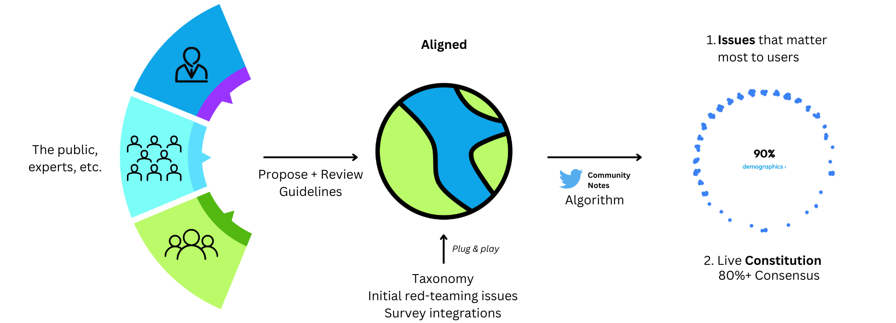

# Aligned: A Platform for Alignment

## Welcome to the Aligned Public Repository

We’re introducing Aligned, a platform for global governance and alignment of frontier models, and eventually superintelligence. While previous efforts at the major AI labs have attempted to gather inputs for alignment, these are often conducted behind closed doors. We aim to set the foundation for a more trustworthy, public-facing approach to safety: a “constitutional committee” framework. We invite other AI labs and teams to plug and play into the Aligned ecosystem.

We're open sourcing this grant work for other AI labs, teams, and companies to use and contribute to.

## About Energize AI

[Energize AI](https://energize.ai/) is a Harvard-MIT-Cal Poly startup based in San Francisco, founded in 2023. Its goal is to achieve 80%+ alignment to public values, using specialized AI safety platforms. Energize was selected by OpenAI for their [Democratic AI Grant](https://openai.com/blog/democratic-inputs-to-ai) to work on alignment.

A special thanks to [X Community Notes](https://communitynotes.twitter.com/guide/en/about/introduction) and [OpenAI](https://openai.com/) for their input.

## Components

1. Platform Fronteend (/app): Collect public inputs via Energize Engine
2. Consensus Algorithm (/aggregation): X Community Notes-inspired bridging algorithm for identifying consensus
3. Taxonomy Builder Module (/taxonomybuilder): Refine a constitutional taxonomy

Backend functionality related to the collection of inputs from users is largely handled by the Energize Engine.

## Aligned Report

We've published a public report detailing the motivations, process, and initial findings in Aligned's development: [Aligned Report](https://energize.ai/openai/).

## Notice

This repository contains files that are planned for open source/OpenAI usage as part of the [Democratic AI Grant program](https://openai.com/blog/democratic-inputs-to-ai). These files will likely be moved to the OpenAI Organization's repository for release in October 2023. An initial transfer is occurring on the night of October 12, 2023.

## Integration

This repository contains code designed for integration with the proprietary Energize Engine owned by Energize AI, Inc. Users and contributors must adhere to Energize AI's terms and conditions. The integration of such technologies does not constitute or allow any claims or access to Energize Engine.

---
Copyright (c) 2023 Energize AI, Inc. All rights reserved.
