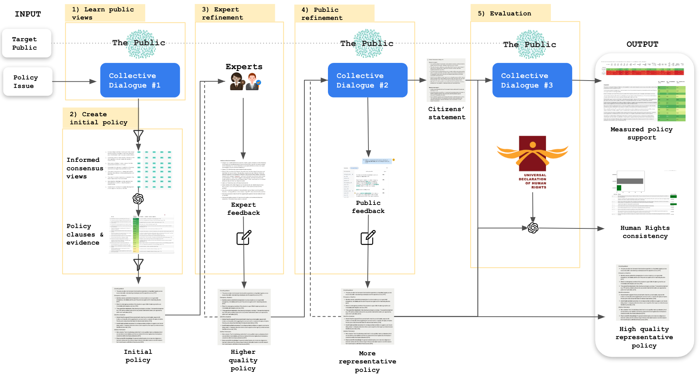

# Collective dialogues for democratic input

***TLDR**: We develop and test a democratic process to produce policy guidelines for AI that reflect informed public will. Full paper [here](https://arxiv.org/pdf/2311.02242.pdf). This repository contains [tools](https://github.com/openai/democratic-inputs/tree/main/projects/collective_dialogues_for_democratic_input/tools), [data, and results](https://github.com/openai/democratic-inputs/tree/main/projects/collective_dialogues_for_democratic_input/experiments) created as the process was developed and tested during OpenAI's [Democratic inputs to AI](https://openai.com/blog/democratic-inputs-to-ai) program.*  

## Process 

**We introduce a democratic process for developing bridging policies that reflect informed public will**. The process integrates deliberative democratic inputs with subject matter expertise to yield policies that are both representative and high quality. Collective dialogues via [Remesh](https://www.remesh.ai/politics-government) make deliberation democratically viable at scale. Bridging-based ranking enables rapid consensus discovery. GPT4-powered [tools](https://github.com/openai/democratic-inputs/tree/main/projects/collective_dialogues_for_democratic_input/tools) make the process efficient. Modularization makes the process reproducible.

*The process*:

1. **Learn public views** – A collective dialogue elicits informed perspectives from a large-scale, carefully selected representative public.
2. **Create initial policy** – Bridging-based ranking is used to identify points of consensus elicited during the collective dialogue. A GPT4-powered pipeline rapidly translates points of consensus into representative policy clauses from which an initial policy is assembled. 
3. **Expert refinement** – Relevant experts refine the policy into a higher-quality version that incorporates specialists' knowledge, minimizes ambiguities, and better handles edge cases.
4. **Public refinement** – The policy is further refined to be more representative through another collective dialogue process with a representative public.
5. **Evaluation** – Public support for the final policy is assessed via collective dialogue with a highly representative public. Consistency with precedent policy is estimated using GPT4.

## Tools

This repository contains 10+ jupyter notebooks developed and used as part of this process. Here we highlight two key [tools](https://github.com/openai/democratic-inputs/tree/main/projects/collective_dialogues_for_democratic_input/tools):

**Policy clause generator** – [This jupyter notebook](https://github.com/openai/democratic-inputs/blob/main/projects/collective_dialogues_for_democratic_input/tools/policy%20generation/policy_gen.ipynb) accelerates step 2. It takes data generated from the collective dialogue in step 1, identifies points of consensus using bridging-based ranking, generates potential policy clauses based on consensus points using GPT4, then builds a list of generated policy clauses along with the evidence that justifies them. 

**Human rights consistency check** – [This jupyter notebook](https://github.com/openai/democratic-inputs/blob/main/projects/collective_dialogues_for_democratic_input/tools/human%20rights%20consitency%20check/check_against_universal_human_rights.ipynb) accelerates step 5. It checks individual policy clauses for their consistency with the [Universal Declaration of Human Rights](https://www.un.org/sites/un2.un.org/files/2021/03/udhr.pdf) using GPT4. 

## Experiments

We test the process by running it to develop AI policy guidelines for situations involving:
* **Medical advice**
* **War and Conflict**
* **Vaccine information**

All data and results for these process runs can be found [here](https://github.com/openai/democratic-inputs/tree/main/projects/collective_dialogues_for_democratic_input/experiments). This includes all jupyter notebooks used for each run, the discussion guide (DG) and results data for each collective dialogue (CD), and the final policy generated by each process:

| Policy issue | CD1 | Policy Gen | CD2 | CD3 | Human rights check | Final policy|
| :-------------:|:-----:|:------------:|:-----:|:-----:|:--------------------:|:-------------:|
|*Medical advice*|[DG](https://github.com/openai/democratic-inputs/blob/main/projects/collective_dialogues_for_democratic_input/experiments/medical%20advice/CD1%20-%20med/CD1_med_DG.csv),[data](https://github.com/openai/democratic-inputs/blob/main/projects/collective_dialogues_for_democratic_input/experiments/medical%20advice/CD1%20-%20med/CD1_med_N200.csv) |[notebook](https://github.com/openai/democratic-inputs/blob/main/projects/collective_dialogues_for_democratic_input/experiments/medical%20advice/CD1%20-%20med/openended_democratic_inputs_to_policy_CD1_med_N200.ipynb)| [DG](https://github.com/openai/democratic-inputs/blob/main/projects/collective_dialogues_for_democratic_input/experiments/medical%20advice/CD2%20-%20med/CD2_med_DG.csv),[data](https://github.com/openai/democratic-inputs/blob/main/projects/collective_dialogues_for_democratic_input/experiments/medical%20advice/CD2%20-%20med/CD2_med.csv)| [DG](https://github.com/openai/democratic-inputs/blob/main/projects/collective_dialogues_for_democratic_input/experiments/medical%20advice/CD3%20-%20med/policy_eval_med_DG.csv),[data](https://github.com/openai/democratic-inputs/blob/main/projects/collective_dialogues_for_democratic_input/experiments/medical%20advice/CD3%20-%20med/policy_eval_med.csv),[notebook](https://github.com/openai/democratic-inputs/blob/main/projects/collective_dialogues_for_democratic_input/experiments/medical%20advice/CD3%20-%20med/policy_eval_med.ipynb)|[notebook](https://github.com/openai/democratic-inputs/blob/main/projects/collective_dialogues_for_democratic_input/experiments/medical%20advice/CD3%20-%20med/medpolicyv0_5_check_against_universal_human_rights.ipynb) | [policy](https://github.com/openai/democratic-inputs/blob/main/projects/collective_dialogues_for_democratic_input/experiments/medical%20advice/final_policy_med.md)|
|*War and Conflict*|[DG](https://github.com/openai/democratic-inputs/blob/main/projects/collective_dialogues_for_democratic_input/experiments/conflict%20and%20war/CD1%20-%20conflict/CD1_conflict_DG.csv),[data](https://github.com/openai/democratic-inputs/blob/main/projects/collective_dialogues_for_democratic_input/experiments/conflict%20and%20war/CD1%20-%20conflict/CD1_conflict.csv) |[notebook](https://github.com/openai/democratic-inputs/blob/main/projects/collective_dialogues_for_democratic_input/experiments/conflict%20and%20war/CD1%20-%20conflict/openended_democratic_inputs_to_policy_CD1_conflict_N300.ipynb) |[DG](https://github.com/openai/democratic-inputs/blob/main/projects/collective_dialogues_for_democratic_input/experiments/conflict%20and%20war/CD2%20-%20conflict/CD2_conflict_DG.csv),[data](https://github.com/openai/democratic-inputs/blob/main/projects/collective_dialogues_for_democratic_input/experiments/conflict%20and%20war/CD2%20-%20conflict/CD2_conflict.csv) |[DG](https://github.com/openai/democratic-inputs/blob/main/projects/collective_dialogues_for_democratic_input/experiments/conflict%20and%20war/CD3%20-%20conflict/CD3_conflict_DG.csv),[data](https://github.com/openai/democratic-inputs/blob/main/projects/collective_dialogues_for_democratic_input/experiments/conflict%20and%20war/CD3%20-%20conflict/CD3_conflict.csv),[notebook](https://github.com/openai/democratic-inputs/blob/main/projects/collective_dialogues_for_democratic_input/experiments/conflict%20and%20war/CD3%20-%20conflict/policy_eval_conflict.ipynb) | [notebook](https://github.com/openai/democratic-inputs/blob/main/projects/collective_dialogues_for_democratic_input/experiments/conflict%20and%20war/CD3%20-%20conflict/conflictpolicyv0_4_check_against_universal_human_rights.ipynb)|[policy](https://github.com/openai/democratic-inputs/blob/main/projects/collective_dialogues_for_democratic_input/experiments/conflict%20and%20war/final_policy_conflict.md)|
|*Vaccine information*|[DG](https://github.com/openai/democratic-inputs/blob/main/projects/collective_dialogues_for_democratic_input/experiments/vaccine%20info/CD1%20-%20vax/CD1_vax_DG.csv),[data](https://github.com/openai/democratic-inputs/blob/main/projects/collective_dialogues_for_democratic_input/experiments/vaccine%20info/CD1%20-%20vax/CD1_vax.csv) |[notebook](https://github.com/openai/democratic-inputs/blob/main/projects/collective_dialogues_for_democratic_input/experiments/vaccine%20info/CD1%20-%20vax/openended_democratic_inputs_to_policy_CD1_vax_N300.ipynb) |[DG](https://github.com/openai/democratic-inputs/blob/main/projects/collective_dialogues_for_democratic_input/experiments/vaccine%20info/CD2%20-%20vax/CD2_vax_DG.csv),[data](https://github.com/openai/democratic-inputs/blob/main/projects/collective_dialogues_for_democratic_input/experiments/vaccine%20info/CD2%20-%20vax/CD2_vax.csv) |[DG](https://github.com/openai/democratic-inputs/blob/main/projects/collective_dialogues_for_democratic_input/experiments/vaccine%20info/CD3%20-%20vax/CD3_vax_DG.csv),[data](https://github.com/openai/democratic-inputs/blob/main/projects/collective_dialogues_for_democratic_input/experiments/vaccine%20info/CD3%20-%20vax/CD3_vax.csv),[notebook](https://github.com/openai/democratic-inputs/blob/main/projects/collective_dialogues_for_democratic_input/experiments/vaccine%20info/CD3%20-%20vax/policy_eval_vax.ipynb) |[notebook](https://github.com/openai/democratic-inputs/blob/main/projects/collective_dialogues_for_democratic_input/experiments/vaccine%20info/CD3%20-%20vax/vaxpolicyv0_4_check_against_universal_human_rights.ipynb) | [policy](https://github.com/openai/democratic-inputs/blob/main/projects/collective_dialogues_for_democratic_input/experiments/vaccine%20info/final_policy_vax.md)|

