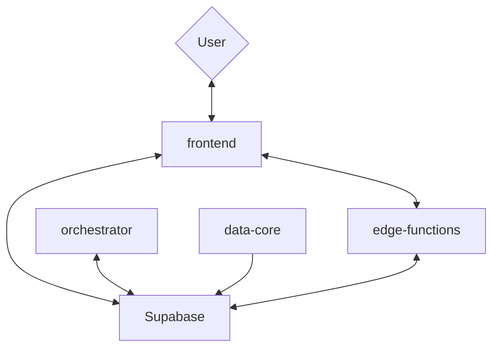
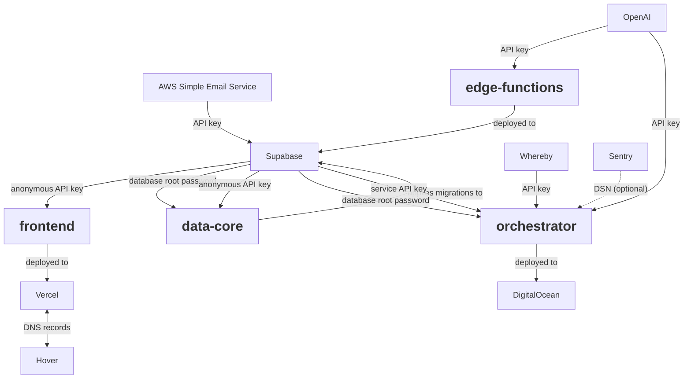

# Deploying Common Ground
This guide attempts to exhaustively document how the Deliberation at Scale /
Common Ground platform should be deployed from scratch. 

As of 04/03/2024, each new event that is organised within the platform must be
deployed from scratch, as the current architecture cannot support multiple
events. This means that for every new event, the a branch should be created,
that is deployed on completely new infrastructure.

## Architecture

### System Architecture
Common Ground consist of multiple components that are connected to each other.
It builds mostly on an database, and associated APIs and SDKs that is provided
by Supabase. While you can host your own Supabase, we currently deploy the
hosted version. 

All submodules are contained in this repository under the `packages` folder. We
distinguish four major components:
* `frontend`: Contains all user-facing components, as a React-based web app
* `edge-functions`: Contains back-end functions that can be called from the
  front-end, currently mostly transcription
* `orchestrator`: Contains a set of event-driven workers that schedule and
  handle periodic tasks, such as creating new rooms, and arranging AI moderation
* `data-core`: Contains the data structures for Supabase as migrations



### External services
The modules and Supabase in turn depend on each other and a host of external
services. These services are as follows:
* OpenAI: Used for transcription (Whisper) and moderation (ChatGPT)
* Vercel: Used to build and host the `frontend`
* DigitalOcean: Used to host the `orchestrator`
* Supabase: Used to host the `edge-functions`
* Hover: Used to register domain names and manage their DNS records
* AWS Simple Email Service: Used for sending e-mails via Supabase
* Whereby: Powers all online meeting rooms

Vercel, DigitalOcean, Hover and AWS SES may be swapped out for other platforms
as needs arise. For the other platforms, we depend on their specific
implementations.

Additionally, we **STRONGLY** recommend using a password manager to store
password, keys and credentials for later reference and usage. We've used
1Password in the past, and it does this jobs excellently.

Dependencies between modules and services may be visualised as follows:



Here, all requirements are summarised in package / platform-specific combinations.

<table>
    <tr>
        <th>Package / Platform</th>
        <th>Platform</th>
        <th>Requirement</th>
    </tr>
    <tr>
        <td rowspan="3"><code>frontend</code></td>
        <td>Vercel <br /><span style="opacity:0.5;">/ any front-end hosting provider</td>
        <td>
            <ul>
                <li>Vercel account</li>
                <li>Authenticated Vercel CLI</li>
            </ul>
        </td>
    </tr>
    <tr>
        <td>Supabase</td>
        <td>Anonymous API key</td>
    </tr>
    <tr>
        <td>Hover <br /><span style="opacity:0.5;">/ any domain provider</span></td>
        <td>Access to DNS records</td>
    </tr>
    <tr>
        <td><code>data-core</code></td>
        <td>Supabase</td>
        <td>
            <ul>
                <li>Database root password</li>
                <li>Anonymous API key</li>
            </ul>
        </td>
    </tr>
    <tr>
        <td rowspan="2"><code>edge-functions</code></td>
        <td>Supabase</td>
        <td>
            <ul>
                <li>Project ID</li>
                <li>Authenticated Supabase CLI</li>
            </ul>
        </td>
    </tr>
    <tr>
        <td>OpenAI</td>
        <td>API key</td>
    </tr>
    <tr>
        <td rowspan="5"><code>orchestrator</code></td>
        <td>Supabase</td>
        <td>
            <ul>
                <li>Database root password</li>
                <li>Service API key</li>
            </ul>
        </td>
    </tr>
    <tr>
        <td>DigitalOcean <br /><span style="opacity:0.5;">/ any VPS provider</span></td>
        <td>Droplet / VPS</td>
    </tr>
    <tr>
        <td>OpenAI</td>
        <td>API key</td>
    </tr>
    <tr>
        <td>Whereby</td>
        <td>API key</td>
    </tr>
    <tr style="opacity:0.5;">
        <td>Sentry (optional)</td>
        <td>DSN key</td>
    </tr>
    <tr>
        <td>Supabase</td>
        <td>AWS Simple Email Service<br /><span style="opacity:0.5;">/ any email provider</span></td>
        <td>SMTP credentials (host, port, username, password)</td>
    </tr>
</table>

## Setup and deployment
This section will take you through all necessary steps to create a deployment
from scratch. Take note that some of these steps have other requirements, such
as particular credentials. These will be mentioned at the top of the subsection.
If you don't have a particular credentials, there's a guide for finding or
creating them under *Finding keys and passwords* at the end of this document.

### Create Git branch
Some events might require tweaks to the codebase, such as logos, specific
landing pages, or settings such as room size and whether anonymous login is
allowed. Since the codebase currently does not support tenants, we will need to
tweak the code. Thus, you will need to create a branch in this repository with
the name of this event, so we can keep track of changes for each event. The
branch should preferably be named `event/[EVENT-NAME]`.

Don't forget to push the branch to origin.

### Setting up Supabase project
*Requirements: SMTP credentials*

#### Creating Supabase Project

This project is built around Supabase, so we'll need a fresh Supabase project
each time we deploy it for a new event. To do so, go to the [*Supabase
Dashboard*](https://supabase.com/dashboard/projects) and click *New project*.
Use the following settings:
* Name: preferably `Common Ground [EVENT-NAME]`
* Instance size: leave it at `Micro` for now. We'll scale this when the event
  happens
* Database password: generate it using your password manager. Aim for
  32-character fully random with special characters. **Don't forget to save this
  in the password manager**
* Region: this should be in the EU for any event with Europeans. For events in the
  Netherlands, `Frankfurt` offers the lowest latency. Note that London is not in
  the EU.

Then, create the project.

#### SMTP Settings
While Supabase is busy setting up the project, we can
already set a couple settings to the right format. First, we'll set our SMTP
credentials. Supabase sends out e-mails by default, but this is rate-limited to
30 an hour, too low for usage during an event. To set these credentials, go to
*Project Settings* → *Authentication* (under Configuration) → *SMTP Settings*.
Use the following settings:

* Enable custom SMTP: `Enabled`
* Sender email: The e-mail address that is associated with the email credentials
* Sender name: depending on the event, `[EVENT-NAME]` or `Dembrane`
* Host: the host where the SMTP server can be accessed from. For AWS this is
  typically `email-smtp.eu-west-1.amazonaws.com`.
* Port number: Whatever your SMTP provider has provided, typically `465` or
  `587`. Please ensure that you don't use unencrypted protocol ports such as
  `25`. For AWS, this is `2587`.
* Minimum interval between emails being sent: `1` second
* Username: provided by SMTP provider
* Password: provided by SMTP provider

Lastly, click *Save*.

#### E-mail settings and templates
Now, we'll setup Supabase to deal correctly with our authentication
requirements. All settings related to authentication are found in the left menu
bar under *Authentication*. First, find *Providers* (under Configuration) and
click *Email* so the accordion opens. Make sure *Confirm email* is set to
`Disabled`. This will ensure users only have to click the magic link once, if
it's their first time logging in. 

Click *Save*.

Then, head over to *Email Templates* and click *Magic Link*. There, you can
customize both the Subject heading and what the email looks like. 

<details>
    <summary>Find a nice e-mail template here if you need one</summary>

    ```html
        <!DOCTYPE HTML PUBLIC "-//W3C//DTD XHTML 1.0 Transitional //EN" "http://www.w3.org/TR/xhtml1/DTD/xhtml1-transitional.dtd">
        <html xmlns="http://www.w3.org/1999/xhtml" xmlns:v="urn:schemas-microsoft-com:vml" xmlns:o="urn:schemas-microsoft-com:office:office">
        <head>
        <!--[if gte mso 9]>
        <xml>
        <o:OfficeDocumentSettings>
            <o:AllowPNG/>
            <o:PixelsPerInch>96</o:PixelsPerInch>
        </o:OfficeDocumentSettings>
        </xml>
        <![endif]-->
        <meta http-equiv="Content-Type" content="text/html; charset=UTF-8">
        <meta name="viewport" content="width=device-width, initial-scale=1.0">
        <meta name="x-apple-disable-message-reformatting">
        <!--[if !mso]><!--><meta http-equiv="X-UA-Compatible" content="IE=edge"><!--<![endif]-->
        <title></title>
        
            <style type="text/css">
            @media only screen and (min-width: 520px) {
        .u-row {
            width: 500px !important;
        }
        .u-row .u-col {
            vertical-align: top;
        }

        .u-row .u-col-100 {
            width: 500px !important;
        }

        }

        @media (max-width: 520px) {
        .u-row-container {
            max-width: 100% !important;
            padding-left: 0px !important;
            padding-right: 0px !important;
        }
        .u-row .u-col {
            min-width: 320px !important;
            max-width: 100% !important;
            display: block !important;
        }
        .u-row {
            width: 100% !important;
        }
        .u-col {
            width: 100% !important;
        }
        .u-col > div {
            margin: 0 auto;
        }
        }
        body {
        margin: 0;
        padding: 0;
        }

        table,
        tr,
        td {
        vertical-align: top;
        border-collapse: collapse;
        }

        p {
        margin: 0;
        }

        .ie-container table,
        .mso-container table {
        table-layout: fixed;
        }

        * {
        line-height: inherit;
        }

        a[x-apple-data-detectors='true'] {
        color: inherit !important;
        text-decoration: none !important;
        }

        @media(prefers-color-scheme: dark) {
        .v-button {
            background-color: #FFFFFF;
            color: #000000;
        }
        }

            </style>
        
        

        </head>

        <body class="clean-body u_body" style="margin: 0;padding: 0;-webkit-text-size-adjust: 100%;">
        <!--[if IE]><div class="ie-container"><![endif]-->
        <!--[if mso]><div class="mso-container"><![endif]-->
        <table id="u_body" style="border-collapse: collapse;table-layout: fixed;border-spacing: 0;mso-table-lspace: 0pt;mso-table-rspace: 0pt;vertical-align: top;min-width: 320px;Margin: 0 auto;width:100%" cellpadding="0" cellspacing="0">
        <tbody>
        <tr style="vertical-align: top">
            <td style="word-break: break-word;border-collapse: collapse !important;vertical-align: top">
            <!--[if (mso)|(IE)]><table width="100%" cellpadding="0" cellspacing="0" border="0"><tr><td align="center"><![endif]-->
            
        
        
        <div class="u-row-container" style="padding: 0px">
        <div class="u-row" style="margin: 0 auto;min-width: 320px;max-width: 500px;overflow-wrap: break-word;word-wrap: break-word;word-break: break-word;">
            <div style="border-collapse: collapse;display: table;width: 100%;height: 100%;">
            <!--[if (mso)|(IE)]><table width="100%" cellpadding="0" cellspacing="0" border="0"><tr><td style="padding: 0px;" align="center"><table cellpadding="0" cellspacing="0" border="0" style="width:500px;"><tr><![endif]-->
            
        <!--[if (mso)|(IE)]><td align="center" width="500" style="width: 500px;padding: 0px;border-top: 0px solid transparent;border-left: 0px solid transparent;border-right: 0px solid transparent;border-bottom: 0px solid transparent;border-radius: 0px;-webkit-border-radius: 0px; -moz-border-radius: 0px;" valign="top"><![endif]-->
        <div class="u-col u-col-100" style="max-width: 320px;min-width: 500px;display: table-cell;vertical-align: top;">
        <div style="height: 100%;width: 100% !important;border-radius: 0px;-webkit-border-radius: 0px; -moz-border-radius: 0px;">
        <!--[if (!mso)&(!IE)]><!--><div style="box-sizing: border-box; height: 100%; padding: 0px;border-top: 0px solid transparent;border-left: 0px solid transparent;border-right: 0px solid transparent;border-bottom: 0px solid transparent;border-radius: 0px;-webkit-border-radius: 0px; -moz-border-radius: 0px;"><!--<![endif]-->
        
        <table style="font-family:arial,helvetica,sans-serif;" role="presentation" cellpadding="0" cellspacing="0" width="100%" border="0">
        <tbody>
            <tr>
            <td style="overflow-wrap:break-word;word-break:break-word;padding:10px;font-family:arial,helvetica,sans-serif;" align="left">
                
        <!--[if mso]><table width="100%"><tr><td><![endif]-->
            <h1 style="margin: 0px; line-height: 140%; text-align: left; word-wrap: break-word; font-family: arial,helvetica,sans-serif; font-size: 22px; font-weight: 400;"><span>Join the BrainWaves conversation!</span></h1>
        <!--[if mso]></td></tr></table><![endif]-->

            </td>
            </tr>
        </tbody>
        </table>

        <table style="font-family:arial,helvetica,sans-serif;" role="presentation" cellpadding="0" cellspacing="0" width="100%" border="0">
        <tbody>
            <tr>
            <td style="overflow-wrap:break-word;word-break:break-word;padding:10px;font-family:arial,helvetica,sans-serif;" align="left">
                
        <div style="font-size: 14px; line-height: 140%; text-align: left; word-wrap: break-word;">
            <p style="line-height: 140%;">Hi {{ .Email }},</p>
        </div>

            </td>
            </tr>
        </tbody>
        </table>

        <table style="font-family:arial,helvetica,sans-serif;" role="presentation" cellpadding="0" cellspacing="0" width="100%" border="0">
        <tbody>
            <tr>
            <td style="overflow-wrap:break-word;word-break:break-word;padding:10px;font-family:arial,helvetica,sans-serif;" align="left">
                
        <div style="font-size: 14px; line-height: 140%; text-align: left; word-wrap: break-word;">
            <p style="line-height: 140%;">Please click the link below to get started!</p>
        </div>

            </td>
            </tr>
        </tbody>
        </table>

        <table style="font-family:arial,helvetica,sans-serif;" role="presentation" cellpadding="0" cellspacing="0" width="100%" border="0">
        <tbody>
            <tr>
            <td style="overflow-wrap:break-word;word-break:break-word;padding:10px;font-family:arial,helvetica,sans-serif;" align="left">
                
        <!--[if mso]><style>.v-button {background: transparent !important;}</style><![endif]-->
        <div align="center">
        <!--[if mso]><v:roundrect xmlns:v="urn:schemas-microsoft-com:vml" xmlns:w="urn:schemas-microsoft-com:office:word" href="BLAH" style="height:36px; v-text-anchor:middle; width:172px;" arcsize="11%"  stroke="f" fillcolor="#000000"><w:anchorlock/><center style="color:#FFFFFF;"><![endif]-->
            <a href="{{ .ConfirmationURL }}" target="_blank" class="v-button" style="box-sizing: border-box;display: inline-block;text-decoration: none;-webkit-text-size-adjust: none;text-align: center;color: #FFFFFF; background-color: #000000; border-radius: 4px;-webkit-border-radius: 4px; -moz-border-radius: 4px; width:auto; max-width:100%; overflow-wrap: break-word; word-break: break-word; word-wrap:break-word; mso-border-alt: none;font-size: 14px;">
            <span style="display:block;padding:10px 20px;line-height:120%;"><span style="line-height: 16.8px;">Join the conversation</span></span>
            </a>
            <!--[if mso]></center></v:roundrect><![endif]-->
        </div>

            </td>
            </tr>
        </tbody>
        </table>


        <table style="font-family:arial,helvetica,sans-serif;" role="presentation" cellpadding="0" cellspacing="0" width="100%" border="0">
        <tbody>
            <tr>
            <td style="overflow-wrap:break-word;word-break:break-word;padding:10px;font-family:arial,helvetica,sans-serif;" align="left">
                
        <!--[if mso]><style>.v-button {background: transparent !important;}</style><![endif]-->
        <div align="center" style="font-size: 10px; color: #838282; line-height: 140%; text-align: left; word-wrap: break-word;">
        <!--[if mso]><v:roundrect xmlns:v="urn:schemas-microsoft-com:vml" xmlns:w="urn:schemas-microsoft-com:office:word" href="BLAH" style="height:36px; v-text-anchor:middle; width:172px;" arcsize="11%"  stroke="f" fillcolor="#000000"><w:anchorlock/><center style="color:#FFFFFF;"><![endif]-->
            <span>If the button above is not visible or doesn&apos;t work, you can also click this URL: </span>
            <a href="{{ .ConfirmationURL }}" target="_blank" class="v-button">
            {{ .ConfirmationURL }}
            </a>
            <!--[if mso]></center></v:roundrect><![endif]-->
        </div>

            </td>
            </tr>
        </tbody>
        </table>

        <table style="font-family:arial,helvetica,sans-serif;" role="presentation" cellpadding="0" cellspacing="0" width="100%" border="0">
        <tbody>
            <tr>
            <td style="overflow-wrap:break-word;word-break:break-word;padding:10px;font-family:arial,helvetica,sans-serif;" align="left">
                
        <table height="0px" align="center" border="0" cellpadding="0" cellspacing="0" width="100%" style="border-collapse: collapse;table-layout: fixed;border-spacing: 0;mso-table-lspace: 0pt;mso-table-rspace: 0pt;vertical-align: top;border-top: 1px solid #BBBBBB;-ms-text-size-adjust: 100%;-webkit-text-size-adjust: 100%">
            <tbody>
            <tr style="vertical-align: top">
                <td style="word-break: break-word;border-collapse: collapse !important;vertical-align: top;font-size: 0px;line-height: 0px;mso-line-height-rule: exactly;-ms-text-size-adjust: 100%;-webkit-text-size-adjust: 100%">
                <span>&#160;</span>
                </td>
            </tr>
            </tbody>
        </table>

            </td>
            </tr>
        </tbody>
        </table>

        <table style="font-family:arial,helvetica,sans-serif;" role="presentation" cellpadding="0" cellspacing="0" width="100%" border="0">
        <tbody>
            <tr>
            <td style="overflow-wrap:break-word;word-break:break-word;padding:10px;font-family:arial,helvetica,sans-serif;" align="left">
                
        <div style="font-size: 10px; color: #838282; line-height: 140%; text-align: left; word-wrap: break-word;">
            <p style="line-height: 140%;">Conversations on Common Ground are enhanced by AI models. When you're in a conversation, any audio will be transcribed and stored. Your contributions in text and in speech will be processed by OpenAI models. No data will be retained by OpenAI for training purposes. All data is stored in the EU. For further questions, please get in touch.</p>
        </div>

            </td>
            </tr>
        </tbody>
        </table>

        <!--[if (!mso)&(!IE)]><!--></div><!--<![endif]-->
        </div>
        </div>
        <!--[if (mso)|(IE)]></td><![endif]-->
            <!--[if (mso)|(IE)]></tr></table></td></tr></table><![endif]-->
            </div>
        </div>
        </div>
        


            <!--[if (mso)|(IE)]></td></tr></table><![endif]-->
            </td>
        </tr>
        </tbody>
        </table>
        <!--[if mso]></div><![endif]-->
        <!--[if IE]></div><![endif]-->
        </body>

        </html>
    ```
</details>

#### Auth URLs
Lastly, you'll need to tell Supabase from which URLs it should accept
authentication. To do this, navigate to *URL Configuration* (under
*Configuration*) on the *Authentication* page. This will show all currently
configured URLs. 

First off, set the *Site URL*, which is used as a fallback when an URL is
invalid. Set this to the URL you are going to use for the event, most commonly
`https://[EVENT-NAME].findcommonground.online`.

Then, add URLs for any additional domains you'd like to enable authentication
for. To ensure this works, use the following format when entering these URLs: `https://[DOMAIN]/**`. At the very least, add the following:
* The Site URL, most likely `https://[EVENT-NAME].findcommonground.online`
* localhost, `http://localhost:3200/**`

### Running migrations in `data-core`
*Requirements: Supabase project, Supabase root password, Supabase anonymous API key*

Now that the Supabase project is set up right, we need to run the migrations in
the `data-core` package. The migrations ensure that the database schema is set
up correctly to be able to store all the data we're going to throw at it. 

Before we run the migrations, we need to set the environment variables for the
package. For `data-core`, this means copying `.env.example` into a file named
`.env` and filling the following variables:
* `DATABASE_URL`, copy the value from Supabase under *Project Settings* →
  *Database* → *Connection string* and replace `[YOUR-PASSWORD]` with the
  database root password you set at the project's creation
* `GRAPHQL_URL`, set this to `https://[SUPABASE-PROJECT-ID].supabase.co/graphql/v1`
* `SUPABASE_PROJECT_ID`, set it to the Supabase project id, found in Supabase
  under *Project Settings* → *General* → *General settings* → *Reference ID* 
* `SUPABASE_ANONYMOUS_API_KEY`, set it to the anonymous Supabase API key (see
  *Finding keys and passwords* if you can't find it)

Now that the environment files are set up right, open a new terminal in the `packages/data-core` folder:
```sh
cd packages/data-core
```

Then, ensure that all Node dependencies are installed correctly:
```sh
npm install
```

Now, we can finally apply the migrations. Do so by running:
```sh
npm run db:migrate
```

After the command is finished, the database schema should be set correctly. You
can double-check this by going to *Database* → *Tables* and checking if tables
such as `moderations` and `opinions` are there.

### Deploying `edge-functions`
*Requirements: Supabase project, OpenAI API key*

Before we can start deploying the edge functions, we'll also need to set up
their environment variables. Since the edge functions are deployed with
Supabase, we'll need to set our environment variables there.

To do so, navigate to *Edge Functions* → *Manage secrets*. Here, you'll find an
overview of the current environment variables. This should already include the
`SUPABASE_URL`, `SUPABASE_ANON_KEY`, `SUPABASE_SERVICE_ROLE_KEY` and
`SUPABASE_DB_URL` keys. Make sure to add the following by clicking *Add new secret*:

* `WHISPER_API_URL`, typically `https://api.openai.com/v1/audio`, unless Whisper
  is deployed elsewhere
* `OPENAI_API_KEY`. If you don't have a key, see *Finding keys and passwords*.
* `APP_URL`, containing the the default URL. This should be the same as the one
  you've set as a Site URL when setting up the Supabase project

Now that the environment variables are set, each Edge function needs to be
deployed individually. To do so, open a terminal and navigate to the package
directory:
```sh
cd packages/edge-functions
```

Ensure that all dependencies are installed correctly:
```sh
npm install
```

Then, make sure you're logged in correctly to the Supabase CLI:
```sh
npx supabase login
```

Lastly, run this command for each edge function you'd like to deploy:
```sh
npx supabase functions deploy [EDGE-FUNCTION-NAME] --project-ref [SUPABASE-PROJECT-ID]
```

The available functions are as follows:
* `transcribe`: Used to transcribe audio from clients
* `login-anonymous`: Used to enable anonymous login

**At the very least, make sure to deploy the `transcribe` edge function!**

### Deploying `orchestrator`
*Requirements: Supabase project, Supabase root password, OpenAI API key,
DigitalOcean droplet, Whereby API key*

The `orchestrator` is a set of NodeJS script that respond to events in the
database by creating rooms, generating moderations and new statements. The
scripts need to be run in a virtual machine so they are always available.
Typically, we use DigitalOcean virtual machines, which are called Droplets.

Multiple events can re-use the same droplet, so long as they are not occurring
in parallel. This means, you usually won't have to set up a droplet yourself. If
a droplet hasn't been setup already, go to *Setting up a droplet* under the
*Optional setup* section.

#### Adding an orchestrator to an existing droplet
Each Supabase instance needs a least one set of orchestrators to work properly.
These orchestrators can live next to each other orchestrators in a single
droplet. To organise this, we create a separate git clone for each separate
orchestrator in the home directory of the droplet.

To make a new clone of the repository, run the following on the droplet:
```sh
git clone [REPO-URL] [EVENT-NAME]
```

Note: if the repository is not public, you might need to create an access token for
the repository. To do so, follow the respective guides for
[Gitlab](https://docs.gitlab.com/ee/user/project/settings/project_access_tokens.html)
or
[GitHub](https://docs.github.com/en/authentication/connecting-to-github-with-ssh/managing-deploy-keys).

Now the repo is cloned, navigate to the Common Ground root. There install all
NodeJS dependencies by running:
```sh
npm install
```

Now, we'll need to setup the orchestrator with the right environment variables.
To do so, create a copy of `.env.example`:
```sh
cd packages/orchestrator
cp .env.example .env
```

Edit the resulting file (e.g. `nano .env` or `vi .env`) and add the following
environment variables to the file:
* `SUPABASE_URL`, the base URL for the Supabase project, typically
  `http://[SUPABASE-PROJECT-ID].supabase.co`
* `SUPABASE_KEY`, the API key for the service role
* `OPENAI_API_KEY`, the OpenAI API key
* `DATABASE_URL`, the connection string that connects directly to the database.
  This is the same string that was used in `data-core`
* `SUPABASE_PROJECT_ID`, the project id for the Supabase project
* `WHEREBY_BEARER_TOKEN`, the token for connecting to the Whereby API

Optionally, you can also set the `SENTRY_DSN` if you want to catch any errors.

Note: if you're stuck in vim, hit `Shift+Esc`, `:`, `x` and then `Enter` to save
the file and exit it.

You will also need to modify `ecosystem.config.js`, to ensure no duplicate names
are used. To do so, edit the file (`nano ecosystem.config.js` or `vi
ecosystem.config.js`) and prefix all `name`s with the name of the event (as such
`name: "runner",` => `name: "brainwaves-runner",`).

Now, we can build and run the orchestrator:
```sh
npm run build
npm run start:prod
npx pm2 save
```

The orchestrator is now running and will continue to do so, even if the script crashes.

### Deploying `front-end`
*Requirements: Supabase project, Vercel account*

The last thing remaining is to deploy the front-end. We typically deploy this
using Vercel, although any host that can serve HTML, JS and CSS will do. To get
this started, ensure you are in the root of the project.

First, ensure you're logged in to the Vercel CLI, by running:
```sh
npm install
npx vercel whoami
```

If you're not yet logged in, run:
```sh
npx vercel login
```

Now, we can start deploying the front-end:
```sh
npx vercel deploy
```

This will spawn an interactive wizard, in which you'll need to enter the
following:
* Set up and deploy "[...]"?: `y`
* (optional) Which scope do you want to deploy to?: Choose the relevant scope
* Link to existing project?: `n`
* What's your project's name?: `common-ground-[EVENT-NAME]`
* In which directory is your code located?: `./packages/frontend`
* Want to modify these settings?" `n`

The CLI will then create a new project and start building and deploying it. This
might fail because we still need to set up a couple things. Navigate to the
Vercel website and find the project you just created. Then, find *Settings* →
*General* → *Build & Development Settings* → *Framework Preset* and ensure it is
set to `Next.js`.

Subsequently, we'll need to set up the right environment variables. To do so,
navigate to *Settings* → *Environment Variables*. Add the following environment
variables:
* `NEXT_PUBLIC_SUPABASE_URL`: the base URL for the Supabase project, typically
  `http://[SUPABASE-PROJECT-ID].supabase.co`
* `NEXT_PUBLIC_GRAPHQL_URL`: the base URL for the Supabase project, appended
  with the GraphQL endpoint, typically:
  `https://[SUPABASE-PROJECT-ID].supabase.co/graphql/v1`
* `NEXT_PUBLIC_SUPABASE_ANON_KEY`: The anonymous role key for the Supabase API.
* `SUPABASE_PROJECT_ID`: The Supabase project id

If you have made changes and need to deploy a new version of the front-end (or
have just changed the environment variables), you can just run this command to
deploy any new versions:
```sh
npx vercel deploy
```

### Setting up custom domain for Vercel project (Hover)
Vercel will generate a URL by default that is based on its `vercel.app` domain.
If you'd like to add a custom domain, head over to the project on the Vercel
website and find *Settings* → *Domains*. Then, enter the domain you'd like to
set up in the input field and hit *Add*.

Then, Vercel will present you with a TXT DNS record that needs to be added to
the domain. Open up the DNS records for that domain (in e.g. Hover) and add the
TXT record. Also make sure to add an additional A or CNAME record for either the domain or
subdomain that points to Vercel. See [their
guide](https://vercel.com/docs/projects/domains/add-a-domain#configure-the-domain)
for this.

Vercel will periodically review whether the domain is set up correctly, and
automatically deploy it for that domain when it is.

## Optional setup (if not already done)
Some services need to be set up only once. This section contains guides for
things you only need to do every once in a while, instead of every time a new
deployment is created.

#### Setting up the droplet
The orchestrator runs in a fairly standard environment. Do consider it might
need to process a ton of events. This means your droplet might need to be a bit
beefy. To err on the safe side, we usually provision one with at least 4
dedicated CPUs and 8GB of RAM.

Create a new Droplet with a stock Ubuntu image, preferably the latest version.
Go through the other options and create the droplet. Once it's created, log into
it via SSH:
```sh
ssh root@[DROPLET-IP]
```

Now, install the Node Version Manager, as it's probably the easiest way for
installing NodeJS:
```sh
curl -o- https://raw.githubusercontent.com/nvm-sh/nvm/v0.39.7/install.sh | bash
nvm install 20
nvm alias default 20
```

Then, we'll set up PM2, a process manager for NodeJS:
```sh
npx pm2 startup
```

You might be asked whether you want to install `pm2`, which you should confirm
by pressing `y`.

Lastly, you might want to set up a cronjob that periodically restarts the
orchestrator, as it currently suffers from an issue in which it stops responding
to events over time. To do so, run the following command to edit the crontab
file:
```sh
crontab -e
```

Then, paste the following line into the file and save it:
```
0 */4 * * * npx pm2 restart all
```

This will restart all orchestrators every four hours to ensure they always work.

### Creating OpenAI API key
You can create a new API key on the [OpenAI Platform website](https://platform.openai.com/api-keys).

### Setting up Whereby organisation
You will probably only need to set up a Whereby organisation once. The process
is currently unnavigable, hence we'll document it here. To get started navigate
to the [Whereby Embedded Sign-up](https://whereby.com/org/signup/embedded).
There, enter your company name and pick a subdomain. Follow all steps until the
organisation is set up.

Now, navigate to the subdomain for the organisation you created and log in. In
the left menu, under *Subscription*, ensure you're subscribed to the monthly
plan and have a credit card on file. This is necessary because there's a limit
to free minutes, which might run out in a particularly busy session.

### Creating Whereby key
Login to Whereby using the organisation URL you've created. Then, navigate to
*Configure* in the left menu, and then click *Generate key*.

### Creating SMTP credentials (AWS Simple Email Service)
[Go to the AWS console, find Amazon Simple Email Service and select SMTP
settings on the
left](https://eu-west-1.console.aws.amazon.com/ses/home?region=eu-west-1#/smtp).
Then, click *Create SMTP credentials* and finish the walkthrough. Don't forget
to save the credentials in a password manager.

## Double-checking before and during events
A couple hours before an event takes place, it's a good idea to do a run-through
of the system, and run some checks so the event runs smoothly. At least take a
look at the following:

* Check that SMTP keys are set and that there are no limits on the amount of
  emails Supabase can send out
* Check that the Whereby organisation has a subscription and a credit card
  saved, so it won't block when it runs out of the free minutes
* Upgrade the Supabase instance size (under *Settings* → *Add Ons* → *Change
  compute size*). You probably don't need the largest instance, but you might as
  well scale up to it for the duration of a short event. **Don't forget to scale
  it back down afterwards though**.
* If you're running a particularly large event, or multiple events in parallel,
  you might want to consider hosting a separate droplet for that event with more resources.

### Debugging
It might be helpful inspect some logs as they are produced. We recommend the
following:
* `orchestrator`: SSH into the Droplet and run `npx pm2 status` or `npx pm2
  logs`
* `edge-functions`: in Supabase, under *Edge Functions*, then click the
  particular function and then *Logs* or *Invocations*
* You can always inspect the relevant table in the Supabase client or in an SQL
  client. There is a Notion page that contains helpful queries to monitor
  waiting times and queues.

## Other
### (multi)-Language setup
Events might use different languages or even multiple languages simultaneously.
While the front-end supports running in English or in Dutch depending on the
browser locale, the database and orchestrator can only support a single language
at a time. 

The orchestrator creates all AI messages. Since it talks to multiple people at
once, it can only speak one language at a time. This language can be altered by
setting the `LANGUAGE_LOCALE` environment variable to either `en` or `nl`.

The database contains a set of seed statements. There can only be one set of
seed statements at a time, hence you will need to pick a single language when
inserting them into the database.

If you wish to support multiple simultaneous languages during an event, you will
need to deploy separate instances for both languages. Run through the guide
above twice and make sure to suffix all names with either `-nl` or `-en`. Then,
use the `LANGUAGE_LOCALE` parameter to set the right language for the orchestrator.

## Finding keys and passwords
In case you're looking for particular passwords, keys or other credentials, this
section contains a short guide where to find them.

### Supabase root password
The Supabase root password was set when the Supabase project is created. It
should be stored in a password manager (1Password). If you cannot find it, you
can reset is by opening your project in Supabase, going to *Settings* →
*Database* → *Database password*. 

Note that when you reset the database password, you will need to change the
environment variables for the `orchestrator` and `data-core`.

### Supabase anonymous and service API keys
API keys are generated once at creation of the Supabase project. You can find
them in Supabase under *Settings* → *API* → *Project API keys*. This page
contains both the anonymous public key, as well as the service key that has
access to all data. 

### DigitalOcean droplet credentials
The droplet authentication might be a root password or more likely a trusted SSH
key. Root passwords should be stored in a password manager (1Password), while
for SSH authentication, someone with access must add your personal SSH key.
Email your public SSH key (found in `~/.ssh/id_rsa.pub`) to someone that has
access to the droplet. Then, connect using `ssh root@[DROPLET-IP]`

### OpenAI API key
OpenAI keys are only visible when generated. Hence, previously generated keys should be
saved to the password manager (1Password), and should be found there. If a new
key needs to be created, go to [*OpenAI Platform* → *API Keys* → *Create new
secret key*](https://platform.openai.com/api-keys). Ensure you are in the right
organisation in the bottom-left corner. Don't forget to save the key in the
password manager.

### AWS Simple Email Service credentials
Note that AWS is only one way of making the email credentials work, and probably
the most hassle if you don't already have an AWS account, you can alternatively
look at Mailgun.

### Sentry DSN
You may use Sentry to track errors that emerge from the orchestrator. This is a
definitely optional setup. If you can't find the DSN anymore, [login to
Sentry](https://sentry.io), find the right project under *Projects*, go to
*Settings* and lastly find the DSNs under *Client Keys (DSN)*.