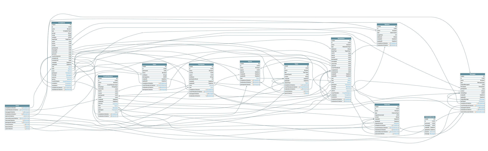

# Deliberation at Scale - Data Core

This project provisions all necessary resources in a Postgres database by having the migrations available here in a structured format.

It also provides some debugging tools to retrieve the Supabase Database Graph to visualize the relations between different entitites in the database.

# Installation
Install all the dependencies:
```
npm run setup
```

Create your `.env` file if you don't have it yet:
```
npm run setup:env
```

Make sure all the environment variables are properly filled in.

# Database migrations
To generate new migrations based on the Drizzle schema changes:
```
npm run db:generate-migrations
```

Once the new SQL files are generated you can run the migrations to apply them to the database:
```
npm run db:migrate
```

# Running in development
To run the development tools:
```
npm run start
```

This currently runs the following services:
- Graphql Voyager (http://localhost:3201/voyager)
