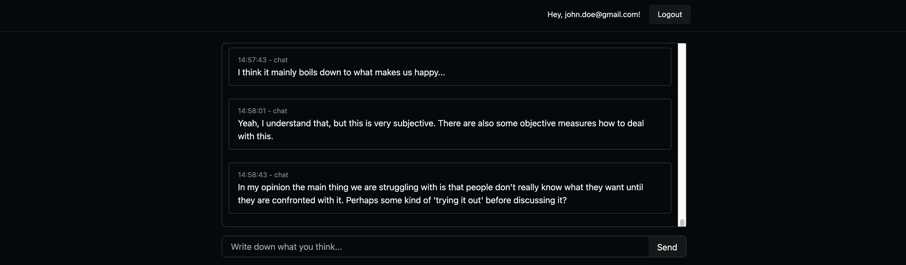
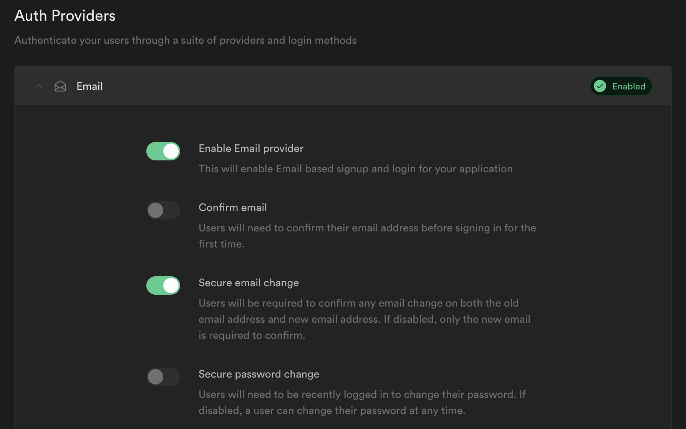

# Deliberation at Scale - Frontend


This frontend demonstrates a basic prototype with a simple chat window where an AI facilitator occasionally summarizes the conversation to actionable and insightful outcomes.

# Installation
Install all the dependencies:
```
npm run setup
```

Provision your `.env` file if you don't have it yet (this will overwrite an existing `.env` file):
```
npm run setup:env
```

Make sure all the environment variables are properly filled in.

# Running in development
To run in development:
```
npm run start
```

If you want to do test the app on devices within your local network, you will
need to use HTTPS, as the `mediaDevices` API is only available on trusted
origins (i.e. HTTPS and localhost). To this, run the above command, and then run
this command in a seperate terminal
```
npm run start:proxy
```

## GraphQL VSCode extension for auto-completion
Install the following VSCode extension: https://marketplace.visualstudio.com/items?itemName=GraphQL.vscode-graphql

`graphql.config.yml` is used by this extension to introspect the schema. If you want it to work properly it is recommended that you open VSCode with the `frontend` directory as root so the extension detects the configuration file correctly.

# Deploying to production

## Vercel
To deploy to vercel:
```
npm run vercel
```

# Authentication
This frontend works only with [Magic Links](https://supabase.com/docs/guides/auth/auth-magic-link) provided by Supabase Authentication. This makes the sign in and sign up page essentially the same page. To make sure users are also created on the first ever login you need to turn off `confirm email` in the `Authentication > Providers` page in the `Email` section.



# Type generation
To make the various clients fetching data type-safe you can generate types from introspecting the database:
```
npm run db:generate-types
```
