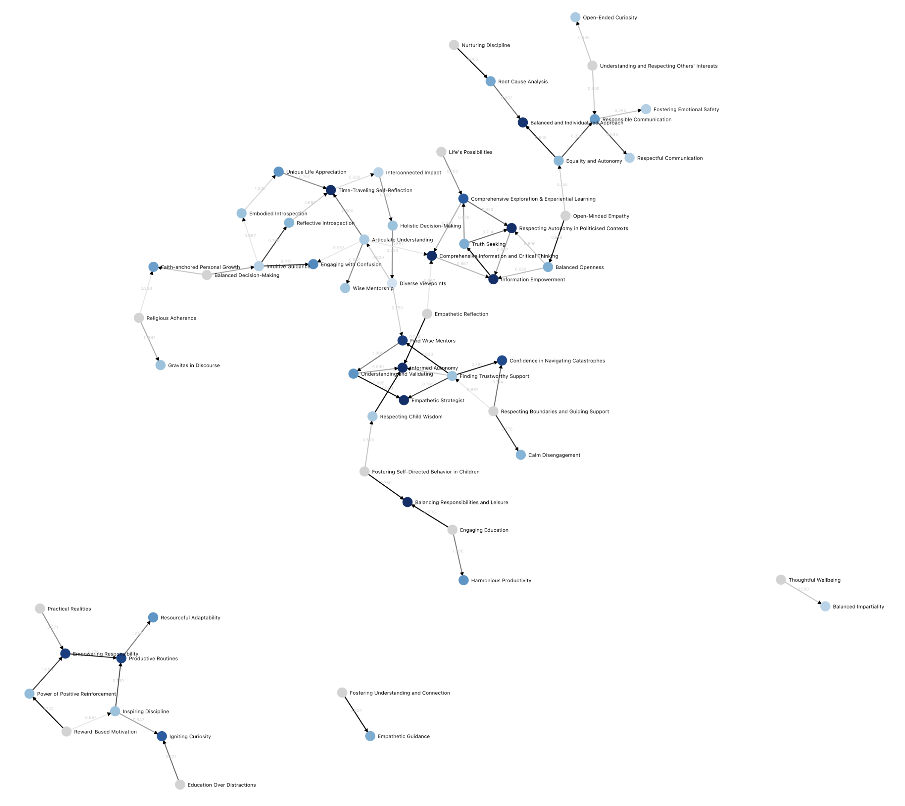

# Democratic Fine-Tuning: README

*Developed by the [Institute for Meaning Alignment](https://www.meaningalignment.org/), funded by [OpenAI](https://openai.com/blog/democratic-inputs-to-ai). Live deployment available at [dft.meaningalignment.org](https://dft.meaningalignment.org).*

## Table of Contents

- [Overview](#overview)
- [Background](#background)
- [Tech Stack](#tech-stack)
- [Output](#output)
- [Local Setup](#local-setup)
- [Database Evolution](#database-evolution)
- [Deployment](#deployment)
- [Testing](#testing)
- [Additional Documentation](#additional-documentation)

## Overview

Democratic Fine-Tuning (DFT) is an initiative aimed at achieving a fine-tuned model that bridges political, cultural, and ideological boundaries. 

This repository hosts code for an application with a new democratic process that takes ~15 minutes to go through. The app is live at [dft.meaningalignment.org](https://dft.meaningalignment.org). 

Participants go through the following steps:

1. **Dialogue**: Participants interact with a chatbot, discussing values they believe ChatGPT should have when responding to contentious questions.
2. **Vote on Values**: Participants vote on values proposed by their peers.
3. **Vote on Wisdom Transition**: Participants vote on wether the transition from one value to another represents an increase in wisdom.

This process generates a moral graph, which can be used to find convergence in which values ChatGPT should have in contentious scenarios, while remaining legible and democratically legitimated.

The intricacies of the graph can be [explored here](https://dft.meaningalignment.org/data/edges). Further insights on the construction of the graph and the data handling can be found in the [data section](#data). For a deep dive into the motivations and processes behind DFT, read our [introduction blog post](https://meaningalignment.substack.com/p/introducing-democratic-fine-tuning).

## Background

Our aspiration with DFT is to craft a model universally regarded as "wise." Such a model would resonate with Republicans, Democrat, irrespective of their ideological or cultural bearings. The ultimate goal is to mitigate the prospects of ideological conflicts amplified by models individually fine-tuned based on group or individual preferences. Two novel techniques are employed:

- **Value Alignment**: Rather than aligning with preferences, the model is aligned with values. These values are sourced from an expansive and diverse demographic. For more on how we define values, [please read the following](https://textbook.sfsd.io/2/making-values-concrete).
- **Moral Graph Creation**: This graph helps find convergent values.

Subsequent endeavors will focus on fine-tuning the LLM based on these values.

## Tech Stack

- **Development Language**: TypeScript
- **Framework**: [Remix](https://remix.run)
- **Database**: PostgreSQL
- **Event Queue**: [Inngest](https://inngest.com)
- **Deployment Platform**: [Vercel](https://vercel.com)

## Output

The moral graph, survey data and demographics data we collected can be found [here](./data/).

- **Database Schema**: The data collated during the process adheres to our [database schema](./schema.prisma).
- **Moral Graph Generation**: The code responsible for generating the moral graph is available [here](./app/values-tools/generate-moral-graph.ts).
- **Data Export**: A moral graph can be exported in JSON format via [this endpoint](http://dft.meaningalignment.org/data/edges.json). The export schema is detailed [here](./app/values-tools/moral-graph-summary.ts).

## Local Setup

1. **Install Dependencies**: `npm i`
2. **Generate Prisma Schema**: `npx prisma generate`
3. **Environment Configuration**: Duplicate `.env.example` to create `.env` and populate it with relevant values.
4. **Run Development Server**: `npm run dev`

## Database Evolution

To update the database schema, execute: `npx prisma migrate dev`

The database schema can be found [here](./schema.prisma).

## Deployment

A push to the main branch of the GitHub repository will trigger an automatic deployment at [dft.meaningalignment.org](https://dft.meaningalignment.org).

## Testing

Some tests leverage GPT-4 for dialogue evaluations. These can be initiated with `npm run test`. Due to their compute-intensive nature, it's advisable to run them only when absolutely necessary.

## Additional Documentation

- [Remix Documentation](https://remix.run/docs)
- [Vercel Documentation](https://vercel.com/docs)

---

*Thank you for your engagement with Democratic Fine-Tuning. We value your contributions and insights.*